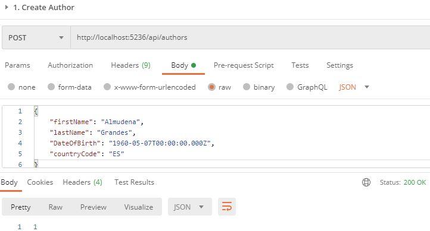

# Relational Module 2 Exercise - Api Rest
API REST lab with SQL Server database persistence. Follow the instructions stored [here](doc/README.md#instructions).

## Solution structure 

```
├── src
│   ├── BookManager
│   	├── Controllers
│   		├── BookManagerController.cs
│   		├── HealthController.cs
│   	├── Extensions
│   		├── ApplicationBuilderExtensions.cs
│   		├── ServiceCollectionExtensions.cs
│   	├── Filters
│   		├── BasicAuthAttribute.cs
│   		├── BasicAuthFilter.cs
│   	├── appsettings.json
│   	├── Program.cs
│   	├── Startup.cs
│   ├── BookManager.Application
│   	├── Models
│   		├── Author.cs
│   		├── Book.cs
│   		├── BookManagerErrorResponse.cs
│   	├── Validators
│   		├── AuthorValidator.cs
│   		├── BookValidator.cs
│   	├── BookManagerService.cs
│   	├── IBookManagerService.cs
│   	├── IBookManagerDbContext.cs
│   ├── BookManager.Domain
│   	├── AuthorEntity.cs
│   	├── BookEntity.css
│   ├── BookManager.Persistence.SqlServer
│   	├── Migrations
│   		├── 20230312173037_InitialCreate.cs
│   		├── BookManagerDbContextModelSnapshot.cs
│   	├── BookManagerDbContext.cs
├── test
│   ├── BookManager.Application.UnitTests
│   	├──ValidatorTests
│   		├── AuthorValidatorTest.cs
│   	├──BookManagerCommandServiceTests.cs
│   	├──Usings.cs
│   ├── BookManager.Application.FunctionalTests
│   	├──TestSupport
│   		├── IntegrationTest.cs
│   	├──appsettings.Test.json
│   	├──BookManagerControllerTests.cs
│   	├──HealthTests.cs
│   ├──Book Manager Rest Api Lemoncode.postman_collection.json
```

## URI Design

| Resource  				|  HTTP Verb	|	CRUD    |  HTTP Status Code |
| ------------------| ------------| --------| ---------------   | 
| api/authors 			| POST	      | Create  | 200 OK (id of the new author)		  | 
| api/books  			  | POST	      | Create	| 200 OK (id of the new book)	 	  | 
| api/books/{id:int}	  | PUT	       | Update	| 200 OK (updated book)	 	  |
| api/books?title=foo&author=bar  | GET	       | Read	| 200 OK (books including author)	 	  |  
| api/health        | GET         | N/A		  | 200	Ok           |


## EF Core NuGet Packages
Entity Framework Core (EF Core) is shipped as NuGet packages. The packages needed by this application using a SQL Server database system are the followings:

|Project        |  EF Core NuGet Package | 
| ----------    |----------------------- |
| BookManager.Persistence.SqlServer | Microsoft.EntityFrameworkCore.SqlServer |
| BookManager.Application| Microsoft.EntityFrameworkCore | 
| BookManager| Microsoft.EntityFrameworkCore.Design | 

## Getting Started
1. Create your database and schema
      
   * Using the .NET Core CLI tools, which work on all platforms, the first migration has been created by running the following EF Core command:
    
     ```
     dotnet ef migrations add InitialCreate --project src/BookManager.Persistence.SqlServer --startup-project src/BookManager
     ```

     You could see the directory called `Migrations` in `BookManager.Persistence.SqlServer` project which defines the following schema:

     ```
     
     CREATE TABLE [Authors] (
          [Id] int NOT NULL IDENTITY,
          [FirstName] nvarchar(100) NOT NULL,
          [LastName] nvarchar(100) NOT NULL,
          [FullName] AS [FirstName] + ' ' + [LastName],
          [DateOfBirth] datetime2 NULL,
          [CountryCode] nvarchar(2) NULL,
          CONSTRAINT [PK_Authors] PRIMARY KEY ([Id])
      );

     CREATE TABLE [Books] (
          [Id] int NOT NULL IDENTITY,
          [Title] nvarchar(150) NOT NULL,
          [PublishedOn] datetime2 NULL,
          [Description] nvarchar(450) NOT NULL,
          [AuthorId] int NOT NULL,
          CONSTRAINT [PK_Books] PRIMARY KEY ([Id]),
          CONSTRAINT [FK_Books_Authors_AuthorId] FOREIGN KEY ([AuthorId]) REFERENCES [Authors] ([Id]) ON DELETE NO ACTION
      );
     
      CREATE UNIQUE INDEX [IX_Authors_FirstName_LastName] ON [Authors] ([FirstName], [LastName]);
      CREATE INDEX [IX_Books_AuthorId] ON [Books] ([AuthorId]);
      CREATE UNIQUE INDEX [IX_Books_Title] ON [Books] ([Title]);
     ```

    
     
 
   * Create your database and your schema from the `InitialCreate` migration using the following EF Core command:
  
      ``` 
      dotnet ef database update --project src/BookManager.Persistence.SqlServer --startup-project src/BookManager
      ``` 

      
      
      

    That's all there is to it - your application is ready to run on your new database.

## How to test this API during development using Postman
1. From Postman, import the `Book Manager Rest Api Lemoncode.postman_collection.json` collection located under `Test` folder.
2. From Visual Studio in Development Mode, run the ASP.NET Core Web API by Pressing F5 key or the green "play" button. Visual Studio should start up a browser automatically.
3. From Postman, send `0. Health` API request. The HTTP response should be 200 OK.
4. From Postman, send `1. Create Author` API request. The 200 OK HTTP response will contain the ID of the author created.
  
5. From Postman, send `2. Create Book With Valid Author` API request. The 200 OK HTTP response will contain the ID of the book created.
  
6. From Postman, send `2. Create Book With Invalid Author` API request. 
  
7. From Postman, send `3. Update Book` API request. 
  
8. From Postman, send `4. Get All Books` API request. 
  

9. From Postman, set `Authorization`, Type `Basic Auth` header. 
  

## How to test this API during development using Swagger

1. From Visual Studio in Development Mode, run the ASP.NET Core Web API by Pressing F5 key or the green "play" button. Visual Studio should start up a browser automatically.


