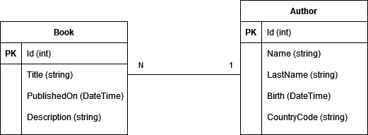

# Relational Module 2 Exercise - Api Rest
API REST lab with SQL Server database persistence. Follow the instructions and store your code in a Git repository.

## Prerequisites
- SDK .NET 7
- EF CLI
- Docker
- SQL Server (in a Docker container)

## Instructions
Create an API REST to manage books with SQL Server persistence, using Entity Framework. This is the initial Entity Relational model



Complete each of the following requirements taking into consideration that is mandatory to complete from 1 to 7, it is optional from 8 to 10, and it is a challenge from 11 to 13.

1. Run `create-structure.bat` y verify that a solution with three empty projects are created (BookManager, BookManager.Application and BookManager.Domain). Open the solution and delete the https and IIS support.

2. Do a `git add .`, `git commit -m "solución inicial"` and `git push` to your remote git repository (GitLab or GitHub) and verify that your changes are pushed correctly.

3. Create a SQL Server database migration using *code first* and the EF CLI. Push your changes to your git repository.

4. Create an endpoint to add Authors (i.e: `POST api/authors`) that accepts payload in json format to create new authors with name, surname, datebirth and nationality as country code of two characters *ISO 3166-1 alpha-2 code*. Push your changes to your git repository.

5. Create an endpoint to add Books (i.e: `POST api/books`) that accepts payload in json format to create new books with title, publish date, description and author's id. Push your changes to your git repository.

6. Create an endpoint to update the title or description of a book (i.e: `PUT api/books/{bookId}`) given its id. Push your changes to your git repository.

7. Create an endpoint to query all books (i.e: `GET api/books`) and return a collection of books with the following information. 
    - Id: the unique identifier of the book
    - Title: the title of the book
    - Description: book's description
    - PublishedOn: the date in ISO_8601 UTC format
    - Author: complete name
    Push your changes to your git repository.

8. Add Swagger/OpenAPI (i.e: nuget packet `Swashbuckle.AspNetCore`) to interact with the endpoints from the url `/swagger`. Push your changes to your git repository.

9. Add a functional test for the following use case: 
   - Given an author 
   - When creating it using the proper endpoint
   - Then it returns the author id that was created.
   Push your changes to your git repository.

10. Add a functional test for the following use case:  
    - Given the creation of an author that has two books 
    - When quering all books using the proper endpoint
    - Then it should return the author and the two books.
    Push your changes to your git repository.

11. Add a filter as a query parameter in `GET api/books?title=foo` to query books with specific title. Push your changes to your git repository.

12. Add another filter as a query parameter in `GET api/books?title=foo&author=bar` to query books with specific title, and also books whose author's name or surname contains the value passed in the filter. Push your changes to your git repository.

13. Add basic authentication with a filter or middleware, with configurable credentials in `appsettings.json` to secure all endpoints and allows only the http requests that contain the `Authorization: Basic <base_64_credentials>` header. Update Swagger and tests accordingly. Push your changes to your git repository.

It will be valued:
- clean code and separation of responsibilities
- implementation of automated testing
- achievement of goals
- documentation of how to run and launch the app for anybody that wants to download the code

## Appendix 

### SQL Server con Docker
To run a SQL Server 2019 serve in local with Docker and `sa / YourStrong!Passw0rd` credentials, run the following:
```
docker run -e "ACCEPT_EULA=Y" -e "MSSQL_SA_PASSWORD=YourStrong!Passw0rd" -p 1433:1433 --name sqlserver2019 -d mcr.microsoft.com/mssql/server:2019-latest
```

If there is any error, you can query the logs with `docker logs sqlserver2019`.

NOTE: If you've got already a container, previously created, called `sqlserver2019`, run it with the following command
```
docker start sqlserver2019
```

### SQL Server connection
Using visual Studio Community Edition, go to *View > SQL Server Object Explorer* and create a new connection to 
Server Name: `localhost`
Authentication: `SQL Server Authentication`
User Name: `sa`
Password: `YourStrong!Passw0rd`
Database Name: `<default>`

### Connection string
to connect code to the database, use the following connection string:
```
"Server=localhost;Database=Books;user=sa;password=YourStrong!Passw0rd;Encrypt=False"
```

NOTE: The above connection string indicates that the database name is `Books`

### Installation of Dotnet EF tool
If you've got already the SDK .NET 7 (i.e: `dotnet --version` shows `7.0.100` or above), install the CLI Entity Framework Core using the following command
```
dotnet tool install --global dotnet-ef
```

You can verify it with 
```
dotnet ef --version
```
that should show something like 
```
Entity Framework Core .NET Command-line Tools
7.0.0
```

If you had a previous version, you can update it with 
```
dotnet tool update --global dotnet-ef
```

### Migrations

``` 
dotnet ef migrations add initial --project src/<project_containing_db_context> --startup-project src/<main_project>
```
A directory called  `Migrations` will be automatically created.

To apply the migrations run the following dotnet CLI command:
``` 
dotnet ef database update --project src/<project_containing_db_context> --startup-project src/<main_project>
```